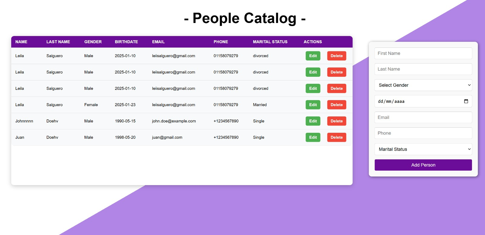

# 💸 Paycash - People 💸

## 🌐 Live Deployments

- **Frontend Deployment**: [https://paycash-seven.vercel.app](https://paycash-seven.vercel.app)
- **Backend Deployment**: The backend is deployed using Docker on Render. Please refer to the instructions below for local setup.
- **MySQL Database Deployment**: The database is deployed using AWS RDS.

---

## 📌 About this project

This project implements a RESTful API for managing a people catalog, using CQRS and Mediator patterns. It allows performing CRUD operations on a set of people, including create, read, update, and delete.

- __Back End__: Node.js, Express, Sequelize
- __Front End__: React.js
- __Database__: MySQL

### 📌 How to get started?

This project requires a `.env` backend and frontend file in the root directory for configuring your database and server.

__Backend:__
File structure for `.env`:
- `DB_HOST='localhost'`
- `DB_USER='username'`
- `DB_PASSWORD='password'`
- `DB_NAME='database_name'`
- `PORT=3000`

#### ❓ Where do I find this data?
- You need to create a MySQL database on your system with a username and password. These are the `DB_USER` and `DB_PASSWORD`.
- `PORT` will be the port your server runs on.
- `DB_HOST` is the host where your MySQL database is running.
- `DB_NAME` is the name of your database.

__Frontend:__
File structure for `.env`:
- `VITE_API_URL='localhost'`

📍 To set up and run the project:

1. In the root directory:
   - Create a `.env` file as explained above.

2. In the `/api` folder:
   - Run `npm install`
   - Run `npm start`

3. In the `/client` folder (optional if you want to set up a front-end):
   - Run `npm install`
   - Run `npm start`

---

## 🐳 Docker Setup (Optional)

### Build and Run Locally:

1. Navigate to the `/api` directory:
   ```bash
   cd paycash-people/api
   ```

2. Build the Docker image:
   ```bash
   docker build -t api .
   ```

3. Run the Docker container:
   ```bash
   docker run -p 3000:3000 --env-file .env api
   ```

---

## 📸 Interface Screenshot

Add a screenshot of your application here for better visualization. For example:
<div align="center"> 
    </img>
</div>

---

## 📌 API Routes

### ⚡️ `GET /api/people`
- Retrieves the list of all people.

**Response Example:**
```
[
    {
        "id": 5,
        "name": "Leila Aylen",
        "lastname": "Salguero",
        "gender": "Female",
        "birthdate": "200.-04-25",
        "email": "leiisalguero@gmail.com",
        "phone": "1158079279",
        "maritalStatus": "Single",
        "createdAt": "2025-01-07T15:48:27.000Z",
        "updatedAt": "2025-01-07T16:30:35.000Z"
    },
    ...
]
```

⚡️ POST /api/people
Creates a new person.

Request Body:
```
{
        "name": "Leila Aylen",
        "lastname": "Salguero",
        "gender": "Female",
        "birthdate": "200.-04-25",
        "email": "leiisalguero@gmail.com",
        "phone": "1158079279",
        "maritalStatus": "Single"
    },
```

⚡️ PUT /api/people/:id
Updates a person by id.
You can send all fields or send only the one you want to update.

Request Body:
```
{
    "name": "Leila Aylen",
     "lastname": "Salguero",
     "gender": "Female",
     "birthdate": "200.-04-25",
     "email": "leiisalguero@gmail.com",
     "phone": "1158079279",
     "maritalStatus": "Single"
}
```

⚡️ DELETE /api/people/:id
Deletes a person by their id.
